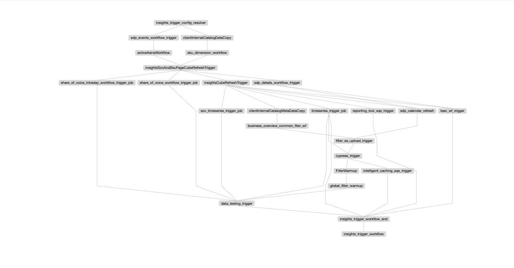

---

description: info about ciq ingestion and ETL flows

---
# E2E ETL workflow


- AVC UI Download and Data Refresh orchestration via azkaban
- Also data aggregation into the *brands_cube* schema. 
- aggregation SQL schemas are defined in -- https://bitbucket.org/commerceiq/custom_brands_cubes
- the azkaban wf defn is at -- https://bitbucket.org/commerceiq/athena_aramus-workflow/src/develop-dbx/aramus-workflow/pom.xml
- the aggregation CCP wf runs at the aws acccount --> ciq-prod/ciq-dbws-prod-3 (dbx account). https://dbc-86231c0f-abf8.cloud.databricks.com/jobs/1043618609869032/runs/574618232691474?o=2986176579409100
- the *main UI download wf* downloads the reports from AVC portal UI through scrapping and triggers few workflow.
- There is a *Discrepancy wf* -- by default the download is done for T-45 days . But sometimes amazon for certain reports actually return historical data of period older than T-45 days . In such case the discrepancy wf , actually finds out the min date across the reports and updates the config table . The next day UI download wf should consider min( T-45 , actual_min date as calculated by discrepancy wf ) . The min data across all reports are considered and that min date is applied for download of all reports as for the purpose of calculating the actual metrics , there is interdependency . SO we go about downloading from the min of min dates so that all reports are in sync
- It also triggers *Insights-wf* -- this one considers the config min date and triggers some merge operation ( in java) and other sql wf ( ?? )
- The download comes into aramus schema .
- Thus in terms of data movement across the schemas following things are possible  -- 
	
	(AVC UI portal) --(Azkaban UI download wf)--> aramus schema --(custom_brands ccp wf)--> brands_cubes (aggregate/metric tables)


	(AVC api integration)  --(Airflow api download wf)--> avc schema --(omni edm population wf)--> edm schema (product_metrics , product_metadata fact tables used by OCC)

	(AVC UI portal) --(Azkaban UI download wf)--> aramus schema --(omni edm population wf)--> edm schema (po sku details// unit cogs metrics product_metrics , product_metadata fact tables used by OCC)


	avc --(enrichment) --> aramus ??

* azkaban wf are in repo -- https://bitbucket.org/commerceiq/athena_aramus-workflow 

### OLAP cubes

custom_brands_cubes --> amz sales data

custom_ams_cubes --> amz market share data, the repo contains the wf code related to population of the cube.

- custom_ams_cubes -- also has wf for other retailer scripts like sov_search_term_metadata etc


### Azkaban FLow : vendor_central_orchestrator_workflow_Europe_V2

- wrapper flow that is cron triggered

```text

      vendor_central_orchestrator_v2_config_resolver_europe

           vendorCentralReportSubOrchestratorEuropeV2

                 vendor_central_orchestrator_workflow_Europe_V2

```

#### Azkaban Job: vendorCentralReportSubOrchestratorEuropeV2

  - VendorCentralReportOrchestratorEuropeV2New -- fetches all valid client for europe region and triggers wf for each 1 of them
  - retailer_id s for Europe -- 2,4,5,6,7,8,10,11,13
  - scripts/vendorCentral-orchestration-v2-new-dbx.sql
  - *As of 2025-11-25: 70 clients*
  


 ### Azkaban Flow: Vendor_central_orchestrator_workflow

	1. Root wf  (Flow name --  *Vendor_central_orchestrator_workflow* ) -- http://prod.azkaban.rboomerang.com:8081/manager?project=aramus-workflow-dbx&flow=vendor_central_orchestrator_workflow_V2
	
	     - Daily 1 run at ( at 0645 IST) typically 2.5 hrs . see the azkaban server *Scheduling* tab
	     - typical execution - http://prod.azkaban.rboomerang.com:8081/executor?execid=15722130
	     - Typica execution has 3 steps ( out of the many )-- 
	     	 - vendor_central_orchestrator_v2_config_resolver
	     	 - *VendorCentralReportSubOrchestratorV2* -- triggers 1 for each client_id -->  vendor_central_sub_orchestrator_workflow_V2
	     	 - vendor_cental_orchestrator_workflow_v2
          
   

   ### Azkaban Flow: vendor_central_orchestrator_workflow_V2
   
   *vendor_central_orchestrator_v2_config_resolver* --> merges job level m uinstance level and flow level properties, this is not at client level , global

   **vendorCentralReportSubOrchestratorV2** () --> trigger azkaban workflow , 1 for each client -- project=aramus-workflow-dbx, flowName=**vendor_central_sub_orchestrator_workflow_V2**
    - fetches applicable clients using this query ( for us region ) -- *vendorCentral-orchestration-v2-new-dbx.sql*
        - This query basically gets the parent_client_id that are registered for vendor central report UNION client_ids that are not in the avc parent-child relationship but are configured for vendor central reports
   
 - *As of 2025-11-25 : 127 clients in North America region*

   ```text


**vendor_central_orchestrator_v2_config_resolver** (com.boomerang.workflow.job.FetchConfigs)
    pushmonTriggerForUSCAUKWorkflowV2Start
        **vendorCentralReportSubOrchestratorV2** (com.boomerang.workflow.job.VendorCentralReportOrchestratorV2New
)
                avc_cross_client_data_check_V2
                    avc_base_tables_cross_client_data_sanity_V2
                        pushmonTriggerForUSCAUKWorkflowV2Completion
                            **vendor_central_orchestrator_workflow_V2**

   ```
	     		
	
	### Azkaban Flow: vendor_central_sub_orchestrator_workflow_V2
	
    - for each client

	```text
   
      vendor_central_sub_orchestrator_v2_config_resolver
           vendorCentralReportOrchestratorV3
               vendorCentralDataMergerOrchestratorV3
                  e2e_event_trigger_US (com.boomerang.workflow.job.E2eEventTrigger) -   ESM-E2E-EventHandler-DBX_prod -- SQS
                     
                
                        edmPipelineTrigger
                              vendor_central_sub_orchestrator_workflow_V2


	```

#### Aramus Service api: VendorCentralReportController.getReportFromVendorCentral

- Downloads the mentioned reports ( java impl ) for the given clients.
- http://aramus-{env}-dbx.rboomerang.com/rest/report/{client}/{env}/{account}/{reportName}


- transform and upload the reports to s3 staging aread
- from staging copy it to the *aramus* schema 

Report Types Triggered

#### Azkaban Job: vendorCentralReportOrchestratorV3

- com.boomerang.workflow.job.VendorCentralReportOrchestratorV2
    - Azkaban  Job is triggred - vendor_central_workflow_V2
- **Basically downloads reports**

 - scripts/vendorCentral-orchestration-suborch-v2.sql
     - fetches the child client_id to download reports 
 
 ```sql
SELECT
    CD_1.ID
,   CD_1.CLIENT
,   CD_1.ACCOUNT
FROM
    CLIENT_CATALOG.ARAMUS.CLIENT_DETAILS    CD_1
LEFT JOIN
    (
        SELECT
            COALESCE(ACPCM.CHILD_CLIENT_ID, CD.ID)  AS  CHILD_ID
        ,   COALESCE(ACPCM.PARENT_CLIENT_ID, CD.ID) AS  PARENT_ID
        FROM
            CLIENT_CATALOG.ARAMUS.CLIENT_DETAILS    CD
        LEFT OUTER JOIN
            CLIENT_CATALOG.ARAMUS
        .AVC_CLIENT_PARENT_CHILD_MAPPING    ACPCM
        ON
            CD.ID           =   ACPCM.PARENT_CLIENT_ID
        AND ACPCM.IS_ACTIVE =   TRUE
        WHERE
            CD.ID   NOT IN  (
                SELECT
                    CHILD_CLIENT_ID
                FROM
                    CLIENT_CATALOG.ARAMUS.AVC_CLIENT_PARENT_CHILD_MAPPING
            )
    )   CD_2
ON
    CD_1.ID =   CD_2.CHILD_ID
WHERE
    CD_2.PARENT_ID  =   ${REPLACE_CLIENT_ID}
;

 ```

 Also calls above api to download the reports 
 triggers vendor_central_workflow_v2
 
##### ARAP Reports (Payment & Reconciliation):

PURCHASE_ORDERS_HISTORY → Purchase order history processing
SHIPMENT_TRACKER → Shipment tracking data
DISPUTE_MANAGEMENT → Dispute management reports
SHORTAGE_INVOICE_SUMMARY → Shortage invoice processing
VIEW_SHORTAGE_DISPUTE → Shortage dispute details
VIEW_INVOICE_DETAILS → Invoice detail reports
POTENTIAL_SHORTAGES → Potential shortage analysis
REMAINING_SHORTAGES → Remaining shortage reports
PAYMENTS_REPORT → Payment processing reports
CHARGEBACK_REPORT → Chargeback analysis
CONTRIBUTION_MARGIN_REPORT → Margin analysis
SUBSCRIBE_AND_SAVE → SNS report processing

##### Standard Vendor Central Reports:

SALES_DIAGNOSTIC_DETAIL → Sales performance analysis
INVENTORY_HEALTH → Inventory status reports
TRAFFIC_DIAGNOSTIC → Traffic analytics
PRODUCT_CATALOG → Product catalog data
DEMAND_FORECAST → Demand forecasting
GEOGRAPHIC_SALES_INSIGHT → Geographic sales analysis
SEARCH_KEYWORD_REPORT → Search performance
MARKET_BASKET_ANALYSIS → Market basket insights
FRESH_* reports → Fresh category specific reports


##### Transformation of the downloaded reports

```text

   Raw Data (Excel/CSV/JSON) 
    ↓
FileParserUtils (Metadata Extraction)
    ↓
XLSXParserUtils (Format Conversion)
    ↓
PurchaseOrderUtils (JSON Processing)
    ↓
VendorCentralReportServiceImpl (Business Logic)
    ↓
Snowflake Database (Final Storage)

```

 Format Transformations
Excel → CSV: XLSX/XLS files converted to CSV with proper encoding
JSON → Structured Data: API responses parsed into Java objects
CSV → Database Records: CSV data loaded into Snowflake tables

**B. Data Structure Transformations**
Nested JSON Flattening: Complex JSON structures flattened for database storage
Header Standardization: CSV headers normalized across different report types
Date Format Normalization: Various date formats converted to standard formats

**C. Business Logic Transformations**
Pagination Handling: Large datasets split into manageable chunks
Currency Conversion: Multi-currency data standardized
Locale-Specific Processing: Region-specific data formatting (DE, FR, ES, IT)

**D. Data Quality Transformations**
Duplicate Detection: Identifies and handles duplicate records
Data Validation: Ensures data meets business rules and constraints
Error Recovery: Handles malformed data and implements fallback mechanisms

**E. Integration Transformations**
API Request Building: Dynamic payload construction for different report types
Session Management: Authentication token handling and renewal
File Upload Coordination: S3 upload with proper metadata and staging


#### Storage

```text
  Raw Data (CSV/JSON) ( datadownloaded to in-memory bytearray)
    ↓
S3 Upload (Staging) (directly uploaded from memory)
    ↓
Databricks Table Creation (Direct S3 Reference) -- (client_catalog.temp.<report_Name>_<acctId>)
    ↓
Data Processing & Transformation
    ↓
Final Tables (client_catalog.aramus.*)
    ↓
Business Intelligence Platform
```

S3Service.java
SnowflakeRepositoryDaoImpl.java


### Azkaban Flow: vendor_central_workflow_V2

basically downloads the UI based reports and then triggers various merger and Tranformation wfs.

```text
 vendor_central_reports_V2_config_resolver
    vendor_central_reports_trigger_V2
        po_sku_level_details_vendor_central_reports_trigger_V2
            po_api_merger
                unit_cogs_workflow_trigger_V2
                    sales_transformation_workflow_trigger
                        inventory_transformation_workflow_trigger
                            lbbRepOOS_transformation_workflow_trigger
                                forecast_transformation_workflow_trigger
                                    fresh_inventory_transformation_workflow_trigger
                                        merge_service_avc_transform_aramus
                                            vendor_central_workflow_V2
      

```

#### *vendor_central_reports_trigger_v2* ( com.boomerang.workflow.job.VendorCentralReportTriggerV2
 ) : In this node, we fetch active UI reports for a client and then trigger them by hitting Aramus Endpoints and then wait for its completion to trigger the next node

 // The main API endpoint called is:
GET /rest/report/{client}/{env}/{account}/{reportname}

VendorCatalogListing
SalesAndInventoryProductDetails
DemandForecast
Chargebacks
FastTrackInstock
LeadTimeDetails
PurchaseOrdersHistory
ShipmentTracker
AMS Sales Report
Geographic Sales Insight
Search Keyword Report


#### po_sku_level_details_vendor_central_reports_trigger_v2:( com.boomerang.workflow.job.PurchaseOrderSkuLevelDetailsVendorCentralTrigger
 )
In this node, we trigger the PO SKU Level report, it’s also a UI report. It’s dependent upon Purchase order history data so triggered after all other UI reports
GET /rest/report/POSkuLevelDetails/{client}/{env}/{account}

#### unit_cogs_workflow_trigger_v2:
In this node, we trigger po-related workflow unit_cogs_from_po using CCP to populate aramus.unit_cogs_from_po


#### sales_transformation_workflow_trigger (TransformationWorkflowTriggerV2)

triggers CCP `transformed_sales_data_wf` -->  `transformed_sales_data_wf_final`
custom_brands_cube brands_base.transformed_sales_data

2 days lookback

#### inventory_transformation_workflow_trigger

custom_brands_cube  transformed_inventory_data_wf

brands_base.transformed_inventory_data / ransformed_sourcing_inventory_data


#### lbbRepOOS_transformation_workflow_trigger

custom_brands_cube.lbb_repoos_transfom_wf
brands_base.transformed_lbb_rep_oos_data

#### forecast_transformation_workflow_trigger

custom_brands_cube . v2_transformed_woc_wf
brands_base.forcasting_transformed_data

45 days lookback

#### fresh_inventory_transformation_workflow_trigger

custom_brands_cube . fresh_transformed_inventory_data_wf

brands_base.fresh_transformed_inventory_dat

4-day lookback

In this node, we trigger fresh-related inventory transformation where fresh is enabled for the client

#### Merge service avc transform aramus:
 It’s used to trigger hybrid merger service to merge transformed table data into aramus table
 avc-merge-service
 Executes queries in Databricks to move data from BRANDS_BASE to ARAMUS schemas

client_catalog.BRANDS_BASE.transformed_sales_data --> client_catalog.aramus.sales_diagnostic_details

### Azkaban FLow: vendor_central_data_merger_workflow

```text
     
vendor_central_data_merger_config_resolver
avc_vendor_central_data_merger_trigger
vendor_central_data_merger_workflow
```

 http://aramus-prod-dbx.rboomerang.com/rest/data/merger/5480?reports=VendorCatalogListing,SalesAndInventoryProductDetails,GeographicSalesInsight

 

https://bitbucket.org/commerceiq/omni-ccp-workflows-spark/src/0ed0da2da5a815d4abc7e1f0f8b28ef03746af42/ccp-configs/workflows/omni_forecasts_final_wf.yaml?at=develop#omni_forecasts_final_wf.yaml-1


/data/merger api is provided by athena-aramus microservice for given client and report names


### e2e_event_trigger

from SQS queue ESM-E2E-EventHandler-DBX_prod --(lambda trigger)-->arn:aws:lambda:us-west-2:208876916689:function:ESM-E2E-EventHandler-DBX_prod

The trigger is through the lambda event handler , where a default event_type of AVC_EVENT ( avc download complete is triggered . THe trigger is on the azkaban server )

 - This triggers - `alertEmailOrchestrator_workflow`
 https://sqs.us-west-2.amazonaws.com/208876916689/ESM-E2E-Events-Queue-DBX-prod 


 ### edm pipeline trigger
 
 only for aramus tables like PO_product_metrics , unit_cogs_prod_metrics
 
 ```json
    {
  "clientId": 253,
  "clientName": "kellogg",
  "retailerId": 1,
  "retailer": "amazon",
  "refreshTablesList": ["client_catalog.edm.product_metrics"],
  "runDate": "2024-01-15",
  "ccpTriggerInfo": {
    "branch": "main",
    "workflowName": "edm_population_wf",
    "repoType": "ESM_EDM_INGESTION",
    "execVariables": [
      {
        "name": "client_id",
        "value": "253"
      },
      {
        "name": "start_date",
        "value": "2023-12-12"
      },
      {
        "name": "end_date",
        "value": "2024-01-11"
      },
      {
        "name": "retailer_id",
        "value": "1"
      },
      {
        "name": "target_table",
        "value": "client_catalog.edm.product_metrics"
      },
      {
        "name": "aggregator_list",
        "value": "AMAZON_PO_PRODUCT_METRICS,AMAZON_UNITCOGS_PRODUCT_METRICS"
      }
    ]
  },
  "eventParams": {
    "eventName": "EDM_AMAZON_ESM_REFRESH",
    "component": "EDM_ESM_REFRESH",
    "runDate": "2024-01-15",
    "client_id": "253",
    "client_name": "kellogg",
    "start_date": "2023-12-12",
    "end_date": "2024-01-11",
    "additionalInfo": {
      "env": "beta",
      "child_client_id": "253",
      "all_child_client_ids": "253",
      "retailer": "amazon",
      "retailer_id": 1,
      "aggregator_list": "AMAZON_PO_PRODUCT_METRICS,AMAZON_UNITCOGS_PRODUCT_METRICS"
    }
  },
  "pagerDutyKey": "prod-pagerduty-key-or-empty"
}
 ```
 
### Azkaban flow: alertEmailOrchestrator_workflow (e2e trigger)

* **insightsTrigger** -- Triggering azkaban flow with following details: AzkabanTriggerCreds [project=aramus-workflow-dbx, flowName=insights_trigger_workflow
    * Request payload: session.id=d9c33ab9-5bcf-4806-b5bb-a2fb37d01402&ajax=executeFlow&project=aramus-workflow-dbx&flow=insights_trigger_workflow&flowOverride[clientdetailsid]=873&flowOverride[service_type]=trigger&flowOverride[service]=insights&flowOverride[client]=nestle-purina&flowOverride[env]=prod&flowOverride[region]=us

**Here the trigger of another azkaban workflow happens through rest api call, from subOrchestrator to this alerEmailOrchestrator happened throgh SQS+Lambda**

* So this is a wrapper step that is called after avc reports are downloaded ( api + ui ) and before the e2e is triggered. The whole point here seems to be calling ccp to run *glance_views_calculation* wf before e2e.

```text

  alert_email_orchestrator_config_resolver
		triggerBackupAndDeleteAVCData
				client_sku_update
						dsCubeExecutor
								*alertEmailOrchestrator* -- insightsTrigger( com.boomerang.workflow.job.InsightsTrigger)
										
												E2ECacheKeyClear (com.boomerang.workflow.job.E2ECacheKeyClear)
														

```


### CCP wf :glance_views_calculation

triggered by **dsCubeExecutor**
  calculates glance_view  aramus.glance_views_post_migration 
  aramus.ds_glance_views

### Azkaban Job: alertEmailOrchestrator

- com.boomerang.workflow.job.AlertEmailOrchestrator 
- runs parallel to insights trigger
- triggers - 'alert_email_workflow'


### Azkaban Flow: alert_email_workflow

**Trigger Params**

```text

      1007
service_type    aramus
rundate 2026-05-21
service alertEmail
poolSize    9
client  medline
env prod
region  us

```


```text


alert_email_config_resolver
    competitionDataForLast120Days
        ams_download_wait
            **alert_modulus_workflows_trigger**
                updateDvtWorkflow
                    alert_modulus_data_quality_check
                        removed_skus_data_copy_trigger
                            *alertEstimateModulusTrigger*
                                alertPushIndexTrigger
                                    alertEstimateCubeGenerationModulusWorkflowTriggerJob
                                    waitJob -- delete_stale_data_trigger -- post_recommendation_email_trigger
                                    
                                    waitJob
                                       email_subscription_trigger
                                    

                                    alert_email_workflow

```


### Azkaban Job: alert_modulus_workflows_trigger

- com.boomerang.workflow.job.AlertEmailE2eTrigger

- this actually runs the ccp sales_decrease_wf trigger

**fetch ccp wf trigger schedule**
```sql

SELECT
    COALESCE(CUSTOM_FREQ.NODE_NAME, DEFAULT_FREQ.NODE_NAME)                             AS  NODE_NAME
,   COALESCE(CUSTOM_FREQ.PRODUCT_LINE, DEFAULT_FREQ.PRODUCT_LINE)                       AS  PRODUCT_LINE
,   COALESCE(CUSTOM_FREQ.SUBSCRIPTION_STATUS, DEFAULT_FREQ.SUBSCRIPTION_STATUS)         AS  SUBSCRIPTION_STATUS
,   COALESCE(CUSTOM_FREQ.FREQUENCY_INTERVAL, DEFAULT_FREQ.FREQUENCY_INTERVAL)           AS  FREQUENCY_INTERVAL
,   COALESCE(CUSTOM_FREQ.ORCHESTRATION_PLATFORM, DEFAULT_FREQ.ORCHESTRATION_PLATFORM)   AS  ORCHESTRATION_PLATFORM
FROM
    (
        SELECT
            NODE_NAME
        ,   PRODUCT_LINE
        ,   SUBSCRIPTION_STATUS
        ,   FREQUENCY_INTERVAL
        ,   ORCHESTRATION_PLATFORM
        FROM
            CLIENT_CATALOG.ARAMUS.WORKFLOW_EXECUTION_SETTINGS
        WHERE
            ORCHESTRATION_PLATFORM  =   'MODULUS'
        AND CLIENT_ID               =   1472
        AND NODE_NAME               IN  ('null')
        AND PRODUCT_LINE            IN  ('RMM', 'PRA', 'ESM')
    )   AS  CUSTOM_FREQ
FULL OUTER JOIN
    (
        SELECT
            NODE_NAME
        ,   PRODUCT_LINE
        ,   SUBSCRIPTION_STATUS
        ,   FREQUENCY_INTERVAL
        ,   ORCHESTRATION_PLATFORM
        FROM
            CLIENT_CATALOG.ARAMUS.WORKFLOW_EXECUTION_SETTINGS
        WHERE
            ORCHESTRATION_PLATFORM  =   'MODULUS'
        AND CLIENT_ID               IS  NULL
        AND NODE_NAME               IN  ('null')
        AND PRODUCT_LINE            IN  ('RMM', 'PRA', 'ESM')
    )   AS  DEFAULT_FREQ
ON
    CUSTOM_FREQ.NODE_NAME               =   DEFAULT_FREQ.NODE_NAME
AND CUSTOM_FREQ.PRODUCT_LINE            =   DEFAULT_FREQ.PRODUCT_LINE
AND CUSTOM_FREQ.SUBSCRIPTION_STATUS     =   DEFAULT_FREQ.SUBSCRIPTION_STATUS
AND CUSTOM_FREQ.ORCHESTRATION_PLATFORM  =   DEFAULT_FREQ.ORCHESTRATION_PLATFORM
;


```

* Main table for client id --> alert name registration ==  CLIENT_CATALOG.ARAMUS
        .ALERT_TYPE_ALERT_NAME_MAPPING  . Metadata table CLIENT_CATALOG.ARAMUS.ALERT_WORKFLOW_METADATA

```sql

SELECT
    ALERT_RAW.ID
,   ALERT_RAW.ALERT_TYPE
,   ALERT_RAW.MODULUS_WORKFLOW
,   ALERT_RAW.CLIENTDETAILSID
,   ALERT_RAW.ALERT_NAME
,   ALERT_RAW.CLIENT
,   ALERT_RAW.REPO_TYPE
,   C_LOCALE.LOCALE
,   ALERT_RAW.PRODUCT_LINE
FROM
    (
        SELECT
            AWM.ID
        ,   AWM.ALERT_TYPE
        ,   AWM.MODULUS_WORKFLOW
        ,   ATALM.CLIENTDETAILSID
        ,   ATALM.ALERT_NAME
        ,   CD.CLIENT
        ,   AWM.REPO_TYPE
        ,   AWM.PRODUCT_LINE
        FROM
            CLIENT_CATALOG.ARAMUS.ALERT_WORKFLOW_METADATA   AWM
        JOIN
            CLIENT_CATALOG.ARAMUS
        .ALERT_TYPE_ALERT_NAME_MAPPING  ATALM
        ON
            AWM.ID                  =   ATALM.ALERT_TYPE_ID
        AND ATALM.WORKFLOW_TRIGGER  =   TRUE
        AND ATALM.CLIENTDETAILSID   =   985
        INNER JOIN
            CLIENT_CATALOG.ARAMUS
        .CLIENT_DETAILS CD
        ON
            CD.ID   =   ATALM.CLIENTDETAILSID
        ORDER BY            RANDOM()
    )   ALERT_RAW
LEFT JOIN
    (
        SELECT
            DISTINCT
            CLIENTDETAILSID
        ,   LOCALE
        FROM
            CLIENT_CATALOG.ARAMUS.CLIENT_LOCALE
    )   C_LOCALE
ON
    ALERT_RAW.CLIENTDETAILSID   =   C_LOCALE.CLIENTDETAILSID
LEFT JOIN
    (
        SELECT
            CLIENT_DETAILS_ID
        ,   MODULUS_WORKFLOW
        ,   ALERT_NAME
        ,   STATUS
        ,   CREATION_DATE
        FROM
            (
                SELECT
                    CLIENT_DETAILS_ID
                ,   MODULUS_WORKFLOW
                ,   ALERT_NAME
                ,   STATUS
                ,   CREATION_DATE
                ,   ROW_NUMBER() OVER(
                        PARTITION BY
                            MODULUS_WORKFLOW
                        ORDER BY
                            CREATION_DATE   DESC
                    )                   AS  ROW_NUM
                FROM
                    CLIENT_CATALOG.ARAMUS.CLIENT_MODULUS_RUN_DETAILS
                WHERE
                    CREATION_DATE       >=  CURRENT_TIMESTAMP() -   INTERVAL    6   HOURS
                AND CLIENT_DETAILS_ID   =   985
                AND COMPONENT           =   'recommendations'
            )   MODULUS_RUN_DETAILS
        WHERE
            ROW_NUM =   1
    )   ALERT_STATUS
ON
    ALERT_RAW.MODULUS_WORKFLOW  =   ALERT_STATUS.MODULUS_WORKFLOW
WHERE
    (
        ALERT_STATUS.STATUS IS  NULL
    OR  ALERT_STATUS.STATUS =   'FAILED'
    )
AND ALERT_RAW.ALERT_TYPE    NOT IN  (
        SELECT
            DISTINCT(ALERT_TYPE)
        FROM
            CLIENT_CATALOG.ARAMUS.WORKFLOW_BLACKLISTED_ALERTS
        WHERE
            CLIENTDETAILSID =   985
    )


```


http://prod.azkaban.rboomerang.com:8081/executor?execid=16092940&job=alert_modulus_workflows_trigger&attempt=0

{change_in_variant_rec_wf,Change in Variants}
 {snsdrop_addon_primeex_rec_wf,SNS drop and addition to addon and prime exclusive events}

 **{alert_sales_decrease_wf,Sales decrease}**
 **{alert_sales_increase_wf,Sales increase}**
 **{price_compression_rec_wf,Price compression recommendations all}**
 {wf_recommendation_duplicate_listing,Duplicate Listing}
 {client_content_changes_wf,Content change all}
 {comp_vpc_alerts_wf_2,Comp VPC all}
 {comp_oos_asins_rec_wf,Comp oos amazon recommendations all}
 **{client_predicted_oos_combined_wf,Predicted OOS combined all}**
 {client_forecast_change_alerts_wf,Change in forecast all}
 **{search_drop_entry_wf,Search entry all}**
 {independent_3p_list,Independent 3P listings}
 **{unavailable_merged_intraday_ef,unavailable_merged_rec}**
 {tagged_3pt_asins_list__intraday_wf,Intraday tagged 3pt list}
 **{intraday_unavailability_buyboxloss_client_wf,Buybox loss all}**
 {po_discrepancy_recommendation,po_discrepancy_rec}

CCP Workflow Trigger Entity: {executionEntityInfo={branch=master, name=alert_sales_decrease_wf, project=CUSTOM_PA_WORKSPACE}, executionVariables=[{name=client_id, value=985}, {name=alertname, value=Sales decrease}, {name=rundate, value=2026-02-02}], sqlConfig={size=MEDIUM}, sparkConfig={}, clientName=trademark, trigger=true}


### Azkaban Job: alertEstimateModulusTrigger

- com.boomerang.workflow.job.AlertEstimateE2eTrigger

- For the alerts configured , this estimates the revenue lost due to that event ( or in other words the revenue $ that can be saved if the client implemented the recommendations ) . This is revenue lost at the asin level 

- so basically finds out all alerts that are enabled for this client . It triggers those wf if they are not already triggered for the day .


* master table of all alerts , global in scope --
  CLIENT_CATALOG.ARAMUS.ALERT_ESTIMATE_WORKFLOW_METADATA( alert name + alert type id --> wf name)


* main client registry and control table ( ui_didplay , email_enable , estimate_wf_trigger , wf_triger)
  CLIENT_CATALOG.ARAMUS.ALERT_TYPE_ALERT_NAME_MAPPING

  ALERT_NAME    MODULUS_WORKFLOW    CLIENT
Predicted OOS combined all --> estimate_predicted_oos_client_wf    simplygoodfoods
Comp oos amazon     --> recommendations all estimate_revenue_comp_oos_workflow  simplygoodfoods
Tagged 3pt list all  --> estimate_revenue_3p_variant_workflow    simplygoodfoods
Buybox loss all  -->   estimate_revenue_buybox_loss_workflow   simplygoodfoods
Sales decrease   -->    **estimate_revenue_sales_drop_workflow**    simplygoodfoods
Price compression recommendations all   -->    estimate_price_compression_workflow simplygoodfoods


CCP Workflow Trigger Entity: {executionEntityInfo={branch=master, name=estimate_revenue_sales_drop_workflow, project=CUSTOM_ARAMUS_ALERT}, executionVariables=[{name=feed_date, value=2026-02-01}, {name=client_id, value=985}, {name=alertname, value=Sales decrease}, {name=clientdetailsid, value=985}], sqlConfig={size=MEDIUM}, sparkConfig={}, clientName=trademark, trigger=true}


https://bitbucket.org/commerceiq/custom_aramus_alert/src/master/ccp-configs/workflows/

wf name --> estimate_revenue_sales_drop_workflow  -- this workflow just aggregates  all alert_sales_decrease trigger to the common recommendations revenue lost table
**client_catalog.aramus.recommendations_revenue_lost**


```sql


SELECT
    ALERT_RAW.ALERT_NAME
,   ALERT_RAW.WORKFLOW_NAME AS  MODULUS_WORKFLOW
,   ALERT_RAW.CLIENT
FROM
    (
        SELECT
            AWM.ALERT_NAME
        ,   AWM.WORKFLOW_NAME
        ,   CD.CLIENT
        FROM
            CLIENT_CATALOG.ARAMUS.ALERT_ESTIMATE_WORKFLOW_METADATA  AWM
        JOIN
            CLIENT_CATALOG.ARAMUS
        .ALERT_TYPE_ALERT_NAME_MAPPING  ATALM
        ON
            AWM.ALERT_TYPE_ID               =   ATALM.ALERT_TYPE_ID
        AND AWM.ALERT_NAME                  =   ATALM.ALERT_NAME
        AND ATALM.ESTIMATE_WORKFLOW_TRIGGER =   TRUE
        AND ATALM.CLIENT_ID                 =   1472
        INNER JOIN
            CLIENT_CATALOG.ARAMUS
        .CLIENT_DETAILS CD
        ON
            CD.ID   =   ATALM.CLIENT_ID
        ORDER BY            RANDOM()
    )   ALERT_RAW
LEFT JOIN
    (
        SELECT
            CLIENT_ID
        ,   MODULUS_WORKFLOW
        ,   ALERT_NAME
        ,   STATUS
        ,   CREATION_DATE
        FROM
            (
                SELECT
                    CLIENT_ID
                ,   MODULUS_WORKFLOW
                ,   ALERT_NAME
                ,   STATUS
                ,   CREATION_DATE
                ,   ROW_NUMBER() OVER(
                        PARTITION BY
                            MODULUS_WORKFLOW
                        ORDER BY
                            CREATION_DATE   DESC
                    )                   AS  ROW_NUM
                FROM
                    CLIENT_CATALOG.ARAMUS.CLIENT_MODULUS_RUN_DETAILS
                WHERE
                    TO_DATE(CREATION_DATE)  =   CURRENT_DATE
                AND CLIENT_ID               =   985
            )   MODULUS_RUN_DETAILS
        WHERE
            ROW_NUM =   1
    )   ALERT_STATUS
ON
    ALERT_RAW.WORKFLOW_NAME =   ALERT_STATUS.MODULUS_WORKFLOW
WHERE
    (
        ALERT_STATUS.STATUS IS  NULL
    OR  ALERT_STATUS.STATUS =   'FAILED'
    )


   
```


### Azkaban Job:: alertEstimateCubeGenerationModulusWorkflowTriggerJob

- triggers ccp wf -- alert_estimate_cube_generation_workflow

- here the estimate is not in terms of revenue lost ( like in case of Sales decrease)
- here the "mean_estimate_value" is calculated for certain types of recommendations and alert like Predicted CRaP ( Price compression recommendation ). 

the final table is  --

*select * from client_catalog.aramus.alert_estimate_sku_level_cube where client_id=1472*

### Azkaban Job:: alertPushIndexTrigger

- triggers the flow **alert_push_daily_indexing_workflow**


#### Azkaban Flow:: alert_push_daily_indexing_workflow

* at this point various alerts are in their respective tables , this java wf copies // indexes all of them to the ES.
* config per alert is stored in --  https://bitbucket.org/commerceiq/athena_alertmodulusconfig/src/master/configs/brand_alerts/prod-dbx/Comp%20oos%20amazon%20recommendations/alert.json
    * This config has the table where teh alerts are stored
* This wf reads the alert rows from this table and calls bulk indexing api of the esm alert manager service (alertPushOrchestrator) -- https://bitbucket.org/commerceiq/athena_alertsmanager/src/master-dbx/ (  config of athena_alertsmanager service -- https://bitbucket.org/commerceiq/athena_alertsbrandmanagerconfig/src/master/alertmgrbrand/vars/env_controls_prod-dbx.yml )

* the alert manager  bulk index api admits the job and asynchronously ( via sqs queue ) ingests the received records to ES.

* On the consumption path the ESM recommendations service reads the data from ES and powers the "recommendation" page


**Flow structure**
```text
    
   alert_push_daily_indexing_config_resolver
        setRefreshFlag
                alertPushOrchestrator
                        daily_index_processing
                internalAlertPushOrchestrator
                        internal_daily_index_processing
        releaseRefreshFlag
            alert_push_daily_indexing_workflow


```


### Azkaban Flow :: insightsTrigger

This is basically an orchestrator over ccp wf s .




```text
   insights_trigger_config_resolver
clientInternalCatalogDataCopy
sdp_events_workflow_trigger
sku_dimension_workflow
activeAsinsWorkflow
insightsSovAndSkuPageCubeRefreshTrigger
sdp_details_workflow_trigger
share_of_voice_intraday_workflow_trigger_job
share_of_voice_workflow_trigger_job
insightsCubeRefreshTrigger
clientInternalCatalogMetaDataCopy
reporting_tool_sqs_trigger
timeseries_trigger_job(com.boomerang.workflow.job.TimeseriesTrigger)
sov_timeseries_trigger_job
lean_wf_trigger
sdp_calendar_refresh
business_overview_common_fiter_wf
filter_es_upload_trigger
cypress_trigger
intelligent_caching_sqs_trigger
FilterWarmup
global_filter_warmup
data_testing_trigger
insights_trigger_workflow_end
insights_trigger_workflow
```

#### insightsSovAndSkuPageCubeRefreshTrigger

- brands_cubes_wf and other insgihts ccp wf  are triggered from this , based on the following metadata tables

 client_catalog.aramus.insights_workflow_metadata

```sql
  s elect iwm.clientdetailsid,iwm.workflow_name, iwm.repository, iwm.priority from client_catalog.aramus.insights_workflow_metadata iwm left join"
    + "(SELECT CLIENT_DETAILS_ID, MODULUS_WORKFLOW, ALERT_NAME, STATUS, CREATION_DATE from (SELECT CLIENT_DETAILS_ID, MODULUS_WORKFLOW,ALERT_NAME, STATUS, CREATION_DATE, row_number() "
    + "OVER (PARTITION BY MODULUS_WORKFLOW ORDER BY CREATION_DATE DESC) AS row_num from client_catalog.aramus.client_modulus_run_details where "
    + "to_date(creation_date) = current_date and component='insights_cubes' and CLIENT_DETAILS_ID=%d"
    + ") modulus_run_details where row_num=1) alert_status  on iwm.workflow_name = alert_status.modulus_workflow where iwm.clientdetailsid=%d and iwm.priority>=%d and iwm.priority<=%d and iwm.product_id=2 and (alert_status.status is null or alert_status.status='FAILED' %s) order by iwm.priority
```

for e.g for client id 1472 ( simplygoodfoods ) , follwoing 3 wf are triggered :-
*base_cubes_wf (Priority 1)*

Repository: custom_brands_cubes
Special Handling: Yes (uses backfill logic)
Output: 25+ modules in brands_cubes schema


*sov_search_widget1_sales_iq_wf (Priority 2)*

Repository: custom_brands_cubes
Standard Handling: client_id, feed_date variables
Output: 3 modules


*sku_level_search_rank_wf (Priority 3)*

Repository: custom_brands_cubes
Standard Handling: client_id, feed_date variables
Output: 5 modules


### Azkaban Job: insightscubeRefreshTrigger

trigger jobs from insights_workflow_metadata that are for insights_cubes component

#### Azkaban insights: timeseries_trigger_job

- com.boomerang.workflow.job.TimeseriesTrigger
Trigger TimeSeries workflow for client =nestle-purina, with parameters= {snowflake.host=boomerangcommerce.snowflakecomputing.com, snowflake.db=brands, clientdetailsid=873, service_type=trigger, service=insights, client=nestle-purina, snowflake.warehouse=brands_wh, env=prod, region=us, snowflake.username=brands_aramus_write_user},azkaban flow =AzkabanTriggerCreds [project=aramus-workflow-dbx, flowName=timeseries_cache_clear, host=http://prod.azkaban.rboomerang.com:8081, userName=azkaban_is_user, password=A2kaban_!S123$, env=prod, executionId=null]

#### Azkaban Job: sdp_calendar_refresh

 - this is only executed for avc only clients. If the client is active ams client then it is skipped.
 - (newell-de( 1070 ) is an ams active client)
 - invokes - POST http://dashboard-service.prod-dbx.commerceiq.ai/calender/refresh otherwise


#### Azkaban Job: Insights Trigger end

- generate a msg on sqs queue with action_type = e2e_complete
- e2e_event handler on lambda - https://bitbucket.org/commerceiq/e2e_event_handler/src/develop/event_handlers/e2e_event.py . triggers another lambda "Trigger_e2e_refresh"

- https://bitbucket.org/commerceiq/ciq-e2e-refresh/src/master/e2e-refresh/src/main/java/com/boomerang/e2e/service/TriggerE2ERefresh.java -- this lambda function triggers another step function 

Step Fn: "e2e-refresh-amazon-dbx-prod"


## base_cubes_wf

## sales_dashboard_widget_wf

https://bitbucket.org/commerceiq/custom_brands_cubes/src/571b016767a1ae44d5f2b87eee91320e91c4a7d3/ccp-configs/sql/sales_dashboard_widget/sales_dashboard_widget.yaml?at=master

intermediate tables:
"all_catalog_skus_on_max_date", "client_attributes", "competition_latest_image_url"]

Triggered by - [[##insights_trigger_workflow]] - as contained in `client_catalog.aramus.insights_workflow_metadata`

brands_base --> brands_cubes

source tables : 

**base_cubes_wf** Triggered by - [[##insights_trigger_workflow]] - as contained in `client_catalog.aramus.insights_workflow_metadata`
brands_base.competition_deduped
 brands_base.competition_deduped
brands_base.competition_deduped

[[##vendor_cental_orchestrator_workflow_v2]] scheduled trigger
aramus.client_retailer_attributes
 aramus.retailer_attributes
 aramus.purchase_orders_sku_level_details_view
 aramus.purchase_orders_history_view
 aramus.client_product_type_mapping
 client_catalog.aramus.client_account_details
 client_catalog.aramus.product_details_view
 client_catalog.aramus.sales_diagnostic_details_view
 aramus.direct_fulfillment
 ARAMUS.INVENTORY_HEALTH_VIEW

 metric_dates_cleanup
 

**copy_dvt_data_to_brands_cubes** triggered by [[##insights_trigger_workflow]] / [[##vendor_central_workflow_V2]]
 dvt.automation_tracker_3p_variant_removal
 dvt.automation_tracker_content_authority
 dvt.automation_tracker_duplicate_listing
 dvt.automation_tracker_intraday_3p_variant_removal
 dvt.automation_tracker_oos_with_inventory_on_hand
 dvt.automation_tracker_po_discrepancy
 dvt.automation_tracker_supressed_asins
 dvt.automation_tracker_unavailable_with_inventory_on_hand
 dvt.automation_tracker_variation_authority_tracking
 dvt.impact_3p_variant_removal
 dvt.impact_content_authority
 dvt.impact_duplicate_listing
 dvt.impact_oos_with_inventory_on_hand
 dvt.impact_po_discrepancy
 dvt.impact_supressed_asins
 dvt.impact_unavailable_inventory_on_hand
 dvt.impact_variation_authority_tracking


### Product specific workflows

- 

### client_view_catalog

- to implement row-level security on top of client_catalog

### brands_base schema

#### campaigns_filter_table

- this filter table is also present in other , retailer specific cubes.
- columns
	- client_id
	- clientdetailsid
	- campaign_id
	- campaign_name
	- serving_status
	- campaign_type
	- campaign_status
	- targeting_type
	- profile_id
	- portfolio_id
	- tactic
	- dimension( 1 -100)


### brands_cube schema

- destination of the e2e 
- powers esm, etc

### edm schema

- "product_metrics" -- data that is common( generalizable ) and available through all retailers
- Mainly powers OCC 


